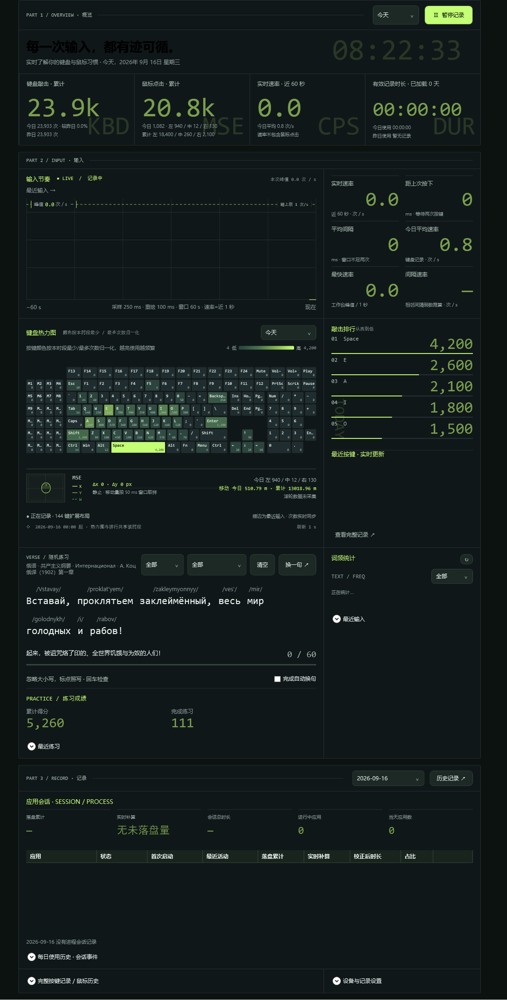

# XAssistant

**XAssistant**（界面署名 **KeyScope**）是一款 Windows 桌面活动统计工具（WPF / C# / .NET 8），常驻系统托盘，记录键盘敲击、鼠标点击与移动、各应用使用时长及电脑使用时长；同界面还附带随机打字练习、词频统计、打字关键词彩蛋等能力。**所有数据仅保存在本机，不联网上传。**



*界面只有一页可滚动的工作台，顶部导航（实时概览 / 输入分析 / 会话记录）只做定位跳转；下方三块板各一个边框，板里再嵌小格，小格之间靠 1 px 发丝线分开。宽度足够时「主体 + 340 右栏」逐行并排，窗口拖窄自动摞回上下。交互细节可能随版本略有差异，以实际运行为准。*

## 它在记什么

四类数据，来源都是系统级接口：不读屏幕、不截屏、不往任何应用里注入东西。

| 采集 | 来源 | 落盘 |
| --- | --- | --- |
| 按键：物理键名 + 时间戳 | 键盘低级钩子 | `key_data.db` |
| 鼠标：左右中键点击、位移、滚轮 | 鼠标低级钩子 | `click_data.db` |
| 前台进程会话：首次启动、最近活动、时长 | WMI 进程事件 | `app_usage.db` |
| 电脑使用时长：开机 / 休眠 / 唤醒 | 后台服务 `XAssistant.Service` | `pc_usage.db` |

词频与打字练习用到的「文本」全部是从已落盘的按键序列推导出来的：程序不知道光标在哪个输入框，也不读任何应用的内容。

## 界面

顶部标题栏：左侧 **KEYSCOPE** 与其后的三个定位按钮（实时概览 / 输入分析 / 会话记录），右缘是版号铭牌；概览板内另有实时时钟与日期。底部页脚常驻：⚙ 直达设置折叠区、开机自启动开关、事件日志按钮（角标带当日条数）、导出记录按钮。关闭窗口只是隐藏到托盘，左键单击托盘图标可重新唤出，真正退出在托盘菜单的「退出」。

工作台是三块通栏大板，每块板一个边框、板头带分区标题：

| 板 | 内容 | 够宽时 | 偏窄时 |
| --- | --- | --- | --- |
| **PART 1 · 概览** | 标语 + 时钟 | 四张统计卡排成一排 | 页面窄于 1000 改两列两张 |
| **PART 2 · 输入** | 输入节奏曲线 / 键盘热力图 / 随机练习 | 六格速率、敲击排行与词频各占 340 右栏 | 右栏摞回主体下方，排行与最近按键再并排一次 |
| **PART 3 · 记录** | 应用会话 / 原始记录 / 设备与记录设置 | 会话表通栏，其下原始记录在主体、设置在右栏 | 依次摊平 |

排布判据只看**页面实际宽度**、逐行判断，不看显示器横竖屏：页面宽 ≥ 940 时四行都拆成「主体 + 右栏」；「横向 · 分栏」档只要 340 塞得进（硬下限 700）就拆，键帽字号自负；「纵向 · 单栏」档整页一列。选择会落盘，下次启动沿用。

### PART 1 · 概览 —— 四张统计卡

卡片左上角的水印区分四块读数，累计值过万自动缩写成 `333.2k`，悬停可见准确数：

- **KBD 键盘敲击 · 累计** —— 今日次数、较昨日的环比、昨日次数。
- **MSE 鼠标点击 · 累计** —— 今日与累计的左 / 中 / 右键明细。
- **CPS 实时速率** —— 近 60 秒的即时速率（次 / s，仅键盘），今日平均速率。
- **DUR 有效记录时长** —— 已加载天数内的累计使用时长，今日与昨日使用时长；数据源（含今日实时的服务校正值 / 数据库快照）会标注出来。

### PART 2 · 输入

- **输入节奏** —— 60 秒滚动曲线（采样 250 ms、重绘 100 ms、连续左移），配峰值示意线与轴上限标注；曲线上方的「最近输入 →」条带实时滚动。右栏六格速率：实时速率、距上次按下、平均间隔、今日平均速率、最快速率、间隔速率（平均间隔倒数推算）。
- **键盘热力图** —— 144 键扩展布局，按当前时段的最少 / 最多次数归一化着色，描边标出最近输入；时段可选今天 / 1、6、12 小时 / 总计 / 昨天 / 前天，热力图、敲击排行与时段累计读数共享同一时段。键盘下方的鼠标行：左 / 中 / 右键点击计数与今日明细、Δx·Δy 与移动速率读数、X / Y 偏移与滚轮速率三条轨迹、今日与累计移动里程（米）、本次滚轮格数；位移窗里的小鼠标图标随手移动偏转、点击时对应区域点亮。整块键盘会跟着手做透视倾转（见下文）。
- **敲击排行** —— 当前时段的前 5 个按键：名次、键名、次数、占比与宽度条，背景水印随所选时段变化；旁边是**最近按键**（时间戳精确到毫秒）与「查看完整记录」入口。
- **随机练习 + 练习成绩** —— 见下文「小功能」；右栏是**词频统计**面板。

### PART 3 · 记录

- **应用会话** —— 一排五格读数：落盘累计 / 实时补算 / 会话总时长 / 进行中应用 / 当天应用数；下方八列表格（应用、状态、首次启动、最近活动、落盘累计、实时补算、校正后时长、占比），进行中的会话按最后落盘时刻补算还没写库的那段。超过 8 个应用时其余并成一行「其他 N 个应用」。
- **每日使用历史 · 会话事件** —— 每天的原始时长与校正时长对比，不一致时标红并给出修正原因（跨午夜拆分、事件缺失、计时差异）；展开可见服务起止与休眠唤醒的会话事件明细（与上次间隔、本次会话时长）。
- **完整按键记录 / 鼠标历史** —— 当前时段逐键计数表、最近 30 条输入，同区可选任意日期的鼠标左 / 中 / 右键历史。
- **设备与记录设置** —— 键盘与鼠标记录的开始 / 暂停、界面主题（深色 KeyScope / 浅色苔绿）、打开悬浮键盘动画窗口、界面布局三档（含判据说明）、打字关键词彩蛋开关与「试一次」。

## 小功能

统计做多了，顺手长出几个附带的小能力。

### 随机打字练习

放在热力图下面，**不用点输入框**：它直接订阅现有的键盘钩子，跟着键盘记录一起开始和暂停，钩子照常把按键交给当前应用——你在哪打字，练习就在哪跟着算。Ctrl / Alt / Win 组合键不写入。

- **题库按目录分档**：`Assets/Practice/<语言>/<句式>.json`，一级目录是语言、文件名是句式，当前 **99 句 / 3 门语言 / 14 个句式**——`英语/` 9 个（伊索寓言、中国寓言、莎士比亚、经典格言、数字练习、中国经典英译、程序员格言、文学名著、日常用语）共 53 句，`日语/` 3 个（平假名注音、片假名罗马音、汉字注音寒暄）共 23 句，`俄语/` 2 个（寓言与故事、共产主义纲要）共 23 句。分类只认目录结构，JSON 里不再重复写；加题就是往对应文件里追加一条带唯一 ID 的句子。
- **日语练的是罗马音**：卡片上面是假名或汉字（带括注读法），下面是要敲的罗马音；长音双写元音、促音双写后一子音、助词按读音走（`は → wa`），约定写在文件里的 `note`。片假名与寒暄句式带 `"mask": true`：字母先遮住成 `_`，敲对了才显形，是默写不是抄写。
- **俄语练的是西里尔原文**：卡片上面的拉丁转写（`Пролетарии → /Proletarii/`）只作认读，要敲的是西里尔字母，**得先把输入法切到俄语布局（Win+空格）**。ё 与 е、«» 与引号、破折号与 `-` 各自等价，不必为它们找键位。
- **注音不参与字符统计**：进度分母与逐格计数只数要敲的 `text + suffix`；注音显示走排除法——假名 / 汉字本身就是要读的正文原样显示，其余（英语 IPA、俄语拉丁转写）包成 `/ˈstedi/` 这种音标壳。题库加载时按黑名单洗一遍不可见字符（控制字符、零宽、BOM、软连字符等剔除，NBSP 折成半角空格），洗掉了什么不静默：练习块顶部会红字写明「哪个文件的哪一句剔掉了 U+XXXX」。
- **判分**：输入按「光标 + 落子」记账，敲对的变绿、被跨过的格子标红并给错词画下划线；对不上的键拒收、计一次错，光标原地不动，所以少敲一个字符也能继续往后敲。退格退回上一子的落点；回车是逃生阀——差四格以内直接补上收尾，差得多先标红、再按一次回车跳过。大小写不敏感，弯直引号等价，全角标点与中文输入法标点一律折叠成半角再比。
- **计分**：`max(10, 字符数 × 2 + 100 − 落子错误次数 × 10)`，跨过的、拒收的、回车补上的格子都算错误，每句只结算一次。累计得分、完成局数与最近 20 条记录（完成时间 / 玩法 / 得分 / 错误提交 / 用时）写在页面下方的「练习成绩」里，历史只追加不覆盖。
- 可以勾「完成自动换句」，也可以手动「换一句 ↗」；先用语言下拉选英语、日语或俄语，再用句式下拉选具体句式，两级候选跟着上一级收窄。

### 词频统计

「输入」板的右栏把按键序列还原成英文词：连续字母与数字算一个词，除退格外其它键都是分隔符，退格会撤销上一个字符——看到的是真实敲出来的词形和改错过程，不是最终上屏内容。

- 👍 / 👎 给词打好坏标记（绿 / 红），筛选有「全部 / 易错 / 已标记」，「易错」就是敲完又用退格改过的词。标记单独存在 `word_marks.db`，重建词频不会丢。
- **增量统计**：只统计投影游标之后的新记录，算过的绝不重算，面板上的「更新至 …」就是这条水位；一次展示频次前 100 项与最近 50 个完成词，还没收尾的片段单独显示在上方。
- **冷启动闸门**：缓存为空、而未统计历史跨度超过 3 天时，只回灌最近 3 天，更早的历史不进自动统计；刷新按钮会写明「统计 35.9 万条 · 约 22 秒」这类量级与预估时间，点它才从第一条重放。整段回灌限速在三成单核，不会把热力图和节奏曲线一起卡住。

### 键盘跟着手倾斜

热力图里的 144 键是一整块悬在屏幕前方的板。敲左边的键，左端就转到远处去——退远那一侧的键帽真的变小、行距变窄，整块板从矩形收成梯形；接着敲右边，板子带着左倾的余势荡回右边；停手 140 ms 后自己回平。近大远小由一台虚拟的针孔相机算出（相机放在 2.2 个板宽之外，敲最右时近端键帽比远端大约 21%）；单靠一块仿射矩阵保持平行性，画不出「远边比近边短」，所以 WPF 里改成**逐颗键帽挂变换**：键帽中心走精确投影、键帽内部用中心处的雅可比做线性部分，144 块拼出完整的梯形透视。越界回收再压回「框 + 余量」，布局区域一格都不动。动画由二阶阻尼弹簧驱动（2.6 Hz / 阻尼比 0.42），每帧最多重算一次姿态，停稳即退出渲染循环。

### 鼠标轨迹

热力图下方的鼠标行：位移窗（84×62）里的小鼠标图标朝指针移动方向偏移、越快偏得越远、停下后回落中心，点击时左 / 中 / 右键区域对应点亮；下方叠三条 6 秒轨迹——X 偏移、Y 偏移用实线，滚轮速率用虚线（往前滚向上凸）。移动按 50 ms 窗口取样，旁边给出 Δx·Δy、速率（px/s、折算 m/s）、今日与累计移动里程（米，按指针路径与显示器点距折算）以及本次运行的滚轮格数。

### 打字关键词彩蛋

敲到 `white` / `black` 就切浅色 / 深色主题，`sunset` 这类还能把整张界面换成另一套配色（主题色是程序化控制的：色板叠在主题字典上，能改哪些画刷键列在 `ThemeManager.BrushKeys` 里）。敲到 `flower`、`cat` 这些词，顶部浮岛下方会落下图案（方向从半圆 180° 扇面里取：正右经正下到正左，沿自己的方向直行，转着越飞越慢、停在半空，再缩小消失），同时屏幕中间出现一句大字、左右斜线铺到屏幕边、四边亮一圈向内渐隐的渐变带（它们算一个动作），那句话就是这条规则自定义的文案。词表在 `Assets/Keywords/keywords.json`：加词、改文案、换颜色不必改代码，条目支持 `word`、`glyph`（单色字形，彩色图放 `Assets/Keywords/images/` 再写 `image`）、`particles`（每次吐几颗，1 就够，上限 4）、`banner`、`theme` / `palette` / `colors`（换肤）等字段。只收英文词：中文输入法下拿到的是拼音字母。彩蛋换肤只在本次运行内有效，设置里两个主题按钮会把它抹回原色；开关与「试一次」（只掉粒子不动主题）在设置区。

### 斜杠命令

打字时直接喊一句上屏：`/warn 3 AI Computer Use`、`/e 1.5-3 编译失败`、`/i 跑完了`——三段是「类型 · 显示秒数-闪几下 · 正文」。类型对应颜色：`error`/`err`/`e`/`r` 红，`warn`/`warning`/`w` 黄，`info`/`log`/`i`/`l` 用当前主题色；只写一个数（`3`）就是闪 3 下、时长用默认（淡入 1 s · 持续 5 s · 淡出 1 s，共 7 s）；再敲一个 `/` 就收起。词表是封闭的：斜杠后第一个词不在表里就整条跳过，收命令期间普通关键词匹配暂停，所以 `/info white` 不会中途换肤。

### 给脚本与 AI 用

同一个 exe 还能无头调用——不建容器、不装钩子、不开主窗、不碰数据库，放完就退。用 `register-xa.ps1` 把 `xa` 注册进 PATH（`deploy.ps1` 部署时会自动做，`-SkipXa` 可跳过），之后在 cmd / PowerShell / AI 工具里直接写一条效果命令：

```
xa -s <色|类型> [持续 [淡入 [淡出]]] [-border on|off [渐宽 [延伸 [周期]]]] [-lable on|off [字号] [文本…]] [-from <平台>]
```

例：`xa -s info 5 1 1 -border on 50 30 1 -lable on 24 "AI 接管中"`。`-s` 段给颜色——颜色名（`green`、`amber`、`#3B82F6` 等）或类型色（`info` / `warn` / `error` 及其缩写）——与三段节奏（默认 5 / 1 / 1 秒）；`-border` 是四边的淡化渐变带：两个数字分别是主带与淡出延伸带的宽度（px），第三个是亮度呼吸的循环周期（秒），总持续时间内自动在明暗之间循环，写 0 就静态亮着；`-lable` 段第一个数字永远是字号，剩下的是条带文案，写 `off` 或不给文案就只剩边框。`xa confetti` 撒花、`xa off` 收起。

旧写法照旧兼容：`XAssistant.exe --fx warn 3 "AI Computer Use"`、`--fx confetti`、`--fx off`。`mcp/xassistant_fx_server.py` 是个纯标准库的 MCP 垫片，把 `xassistant_banner` / `xassistant_confetti` / `xassistant_off` 三个工具翻译成上面的命令；可执行文件位置读环境变量 `XASSISTANT_EXE`。

带文字的命令除了全屏那几秒，还会在屏幕顶居中钉一张**持久消息卡片**（文案 + 时间戳，新消息插最前、旧的往下排着可回看，单条 ✕ 或清空全部，同屏最多 10 张）——全屏大字淡完就没了，但「AI 在等你」这件事不该凭空蒸发。写了 `-from <平台>` 的卡片头部是一枚**来源徽章**：IDE 图标（`Assets/IdeIcons/`，由 `mcp/agent-hooks/extract-ide-icons.ps1` 从各家 exe 抽 256px 高清帧）贴在淡化主题色的圆底上，没抽到图标的平台退首字母徽章，没写来源保持素色条。卡片由常驻的 XAssistant 主程序钉住（命令经本机命名管道交给它，多个 xa 调用不会抢屏）；主程序没跑时全屏效果照放、卡片没人钉。

### AI 编码代理的对话状态提醒

用 AI 编码代理写对话（尤其它接管屏幕、自己点鼠标时），AI 卡在你这一侧往往没人提醒。`mcp/agent-hooks/install-agent-hooks.ps1` 把各家的对话生命周期事件接进上面的 `xa`，三级分档：

| 状态 | 触发事件 | 提醒（机械式文案） |
|---|---|---|
| 报错打断（红） | `PostToolUseFailure`（Claude/Qoder）；`StopFailure`（整轮回复被限流/配额/API 错误打断，如 token limit）；Trae 无这两个事件，走 `PostToolUse` 的 exit_code / tool_response.is_error | 全屏红带「故障 / 中断 · 请求人类介入：项目 · “标题” · <报错>」+ 四边渐变带 + 消息卡 |
| 需人工接管（黄） | `PermissionRequest`、`Notification`（确认/提问类通知，**未知类型宁可多报不漏**） | 黄带「提问 / 接管 / 授权(工具) · 请求人类介入：项目 · “标题”」+ 消息卡 |
| 对话结束（普通） | `Stop` | info 色「回复 · 已完成：项目 · “标题”」，5 秒 |

文案格式固定为「事件词 · 行动指令：上下文」：项目名取事件 `cwd` 的叶目录，对话标题读 `transcript_path` 会话文件的首条用户消息（截 24 字），多项目并行时一眼看出是哪场对话卡住了；事件自带的机器码文案（如 `AskUserQuestion`）映射到事件词，缺哪段省哪段。提醒文案里不写颜色词，颜色由效果本身表达。

**各平台的事件集合不一样，装错了等于没装**：Claude Code / Qoder 挂全套 4 事件；Trae 官方只有 6 个事件（没有 `PermissionRequest`/`PostToolUseFailure`，挂上去永不触发），它的「等待确认」与「任务完成」都用 `Notification(idle_prompt)` 发——所以安装器按平台落地不同事件集，`agent-status.ps1` 里 `idle_prompt` 也按平台分流（Trae 当完成静默交给 Stop，其他平台当空闲等人归黄）。

一键装 / 拆：

```
powershell -ExecutionPolicy Bypass -File mcp\agent-hooks\install-agent-hooks.ps1 -List                              # 看平台表与验证状态
powershell -ExecutionPolicy Bypass -File mcp\agent-hooks\install-agent-hooks.ps1 -Platform qoder                   # 装 Qoder CN
powershell -ExecutionPolicy Bypass -File mcp\agent-hooks\install-agent-hooks.ps1 -Platform trae                    # 装 Trae CN
powershell -ExecutionPolicy Bypass -File mcp\agent-hooks\install-agent-hooks.ps1 -Platform trae -DryRun            # 只看会写什么
powershell -ExecutionPolicy Bypass -File mcp\agent-hooks\install-agent-hooks.ps1 -Platform qoder -Remove           # 拆
```

脚本拷到各配置根的 `hooks\agent-status.ps1`，只增删指向它的条目（你自己挂的别家 hooks 原样保留、先备份 `.bak`），命令自动带 `-from <平台>` 让消息卡认得出来源。**Qoder / Claude Code 的 hooks 不支持热重载，装完重启 IDE 生效**（Trae 改完建议也重启一次；IDE 自动更新可能把配置改旧或把主程序带走，更新后没提醒先重跑安装脚本并确认 XAssistant 在跑）。每次触发都把原始事件 JSON 记进 `%LOCALAPPDATA%\XAssistant\agent-hooks\agent-status.log`，字段对不上时拿它校准；脚本按 **UTF-8 直读 stdin**（PowerShell 控制台默认拿系统 GBK 码页解码，而 Stop 事件带着回复全文 `last_assistant_message`——中文一花 JSON 结构就碎，曾把正常结束误报成红档「事件数据不完整」），真遇到截断时也是正则捞回事件名报红而非静默吞。提醒脚本永远 `exit 0`，再坏也不会阻断对话。改完 `mcp/agent-hooks/` 里的脚本跑一次 `selftest.ps1`（42 项断言：装/幂等/结构自适应/拆卸不伤用户条目/各平台事件分诊与静默/来源标记）。新装 IDE 想上徽章：跑 `extract-ide-icons.ps1` 重抽一轮图标。

生效与排查：

- **首次启用**：跑安装脚本 → 重启 IDE → 下一轮对话回复结束时就该闪出 info 色「回复 · 已完成」并钉一张顶部消息卡。没钉卡不代表没提醒——消息栈由常驻主程序钉，主程序没跑（且开机自启没开）时只有全屏效果。
- **某个事件没反应**：先查 `agent-status.log` 里有没有该事件的新行——没有 = 这个平台根本没有那个事件名（去官方文档对事件表，本仓库实盘报告 `mcp/ide-hooks-takeover-detection.md` 有各家对照）；有行没提醒 = 分诊条件没命中（log 里的原始 JSON 能直接看出字段差异）。
- **不想被打扰**：加 `-Remove` 拆下；临时静音可直接 `xa off` 收起当前全屏带（顶部卡片是历史，用它自己的「清空全部」）。
- **手动试一把**（不必等真实事件）：`'{"hook_event_name":"PostToolUse","exit_code":1,"cwd":"D:\\repo"}' | powershell -File ~\.trae-cn\hooks\agent-status.ps1 -Platform trae`，屏幕应闪红带「故障 · 请求人类介入：repo · 退出码 1」。

### 悬浮键盘动画窗口

设置里可打开独立的键盘动画窗口：透明、无边框、置顶，实时回放按键热力与鼠标轨迹（WebView2 渲染），可拖拽、可关，单实例复用。

### 钩子探活与后台落库

- **钩子探活**：低级钩子被系统静默摘掉时（安装线程不再泵消息就不会有通知），定时器用「回调计数 + 光标位置」两个证据发现并自动重装。
- **后台落库**：按键与鼠标写入从钩子回调线程挪进有界批量队列，退出前排空在途批次，回调线程里不做任何磁盘等待。

规则细节与实测数据见 [`Services/WordFrequency.md`](Services/WordFrequency.md)；练习题库的编写约束见 [`docs/typing-practice.md`](docs/typing-practice.md)；采集与落库契约见 [`docs/input-events.md`](docs/input-events.md)。

## 安装

1. 从 Releases 下载两个压缩包：主程序 `XAssistant-win-x64-*.zip` 与后台服务 `XAssistant.Service-win-x64-*.zip`。
2. 解压到同一文件夹，保持目录结构：

   ```
   你的文件夹/
   ├─ XAssistant.exe
   └─ XAssistant.Service/
      ├─ XAssistant.Service.exe
      └─ install-service.ps1
   ```

3. 右键 `install-service.ps1` → **使用 PowerShell 运行**（会请求管理员授权），或在管理员 PowerShell 中执行：

   ```powershell
   powershell -ExecutionPolicy Bypass -File .\XAssistant.Service\install-service.ps1
   ```

4. 双击 `XAssistant.exe` 即可。
5. 默认**不会**开机自启动。需要常驻统计的话，在界面**最底部**那一栏打开「**开机自启动**」开关，之后随系统登录自动运行。

> 不装后台服务也能用键盘 / 鼠标 / 应用时长等功能，仅"电脑使用时长"无法获取。

## 支持环境

- 亲测环境：Windows 10 专业版 22H2（19045），64 位
- 直接运行 Release 包**无需安装 .NET**（已自包含打包）
- 其它环境不保证兼容

## 数据存储

- 主程序数据：`%APPDATA%\XAssistant`
  - `key_data.db` 按键记录 / `click_data.db` 鼠标点击与移动里程 / `app_usage.db` 应用会话
  - `word_frequency.db` 词频投影（可删可重建，删掉后重新统计只回灌最近 3 天）/ `word_marks.db` 词的赞踩标记
  - `practice-scores.json` 练习成绩
  - `appsettings.json` 配置
- 后台服务数据：`%ProgramData%\XAssistant\UsageTracker\pc_usage.db`（电脑使用时长，由 `XAssistant.Service` 写入）
- 日志：`%APPDATA%\XAssistant\logs\`（按天滚动，保留 31 天）

均为本地文件，不联网上传。

## 灵感速记（可选）

全局热键默认 `Win+Numpad0`，在任意应用里按一下唤起原生速记小窗（带当前前台窗口标题作来源），`Ctrl+Enter` 保存、`Esc` 取消、保存失败内容保留可重试，成功弹右下角 toast 确认；托盘菜单里也有「打开速记窗」与「速记列表」入口。编辑 `%APPDATA%\XAssistant\appsettings.json`，在 `QuickNote` 节点填写 PostgreSQL 连接串即可启用：

```json
{
  "QuickNote": {
    "ConnectionString": "Host=主机;Port=5432;Database=库名;Username=用户;Password=密码"
  }
}
```

未配置时该功能禁用，不影响其它功能。也可以只填 `DatabaseUrlEnvPath` 指向一个 `.env`，程序会读取其中的 `DATABASE_URL`：留空就读数据目录下的 `.env`，填相对路径也按数据目录解析，只有要指到别的盘时才需写绝对路径。热键可在 `QuickNote.HotKey` 修改（格式如 `Ctrl+Alt+N`，支持 Ctrl / Alt / Shift / Win + 字母数字或 Numpad0-9 等）；「速记列表」按基址打开浏览器标签（Debug 开发版 `http://localhost:3009`，Release 生产版 `http://localhost:9009`，可用 `QuickNote.SpaBaseUrl` 覆盖）。`.env` 与 `appsettings.json` 都带凭据，不要提交进仓库。

## 构建

```powershell
# 构建整个解决方案（主程序 + 后台服务）
dotnet build XAssistant.sln -c Release

# 发布主程序（自包含，win-x64）
dotnet publish XAssistant.csproj -r win-x64 -c Release --self-contained true

# 发布后台服务（自包含，win-x64）
dotnet publish XAssistant.Service\XAssistant.Service.csproj -c Release --self-contained true -r win-x64
```

需安装 [.NET 8 SDK](https://dotnet.microsoft.com/download)（主程序与后台服务都是 `net8.0-windows`）。

调试构建（`DEBUG`）的数据写在 `%APPDATA%\XAssistant_Dev`，与正式版分开，方便两个版本同时跑。

## 许可证

[MIT](./LICENSE)